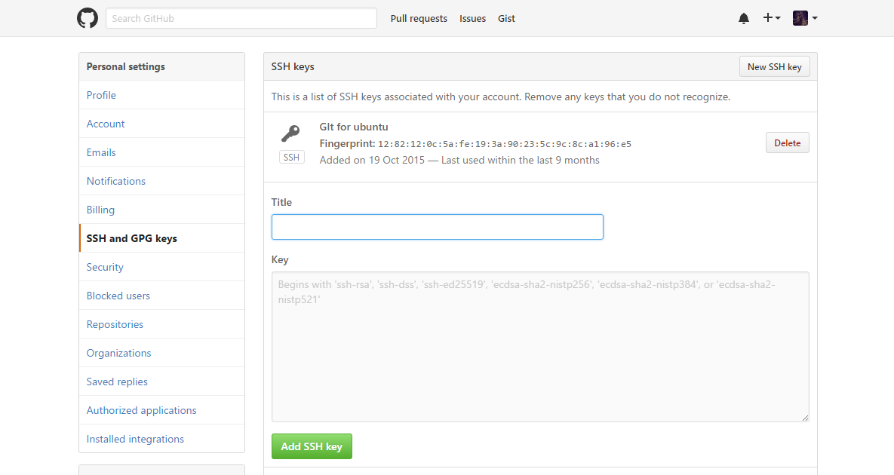

+++
categories = ["学无止境"]
date = "2016-12-27"
description = "总结了一下安装完git到正常使用需要做的一些配置工作"
draft = false
tags = ["Git"]
title = "git相关配置"
+++

#### 1 配置用户名和邮箱
    $ git config --global user.name "yourname”
    $ git config --global user.email youremail
* 去掉`--global`则只会配置当前项目的用户名和邮箱
* 用户名和邮箱可以不与github账号相同。如果使用github账号，commit记录会链接到你的github账号

#### 2 生成SSH key
	$ ssh-keygen -t rsa -C "youremail"
* `-t` type 指定密钥类型
* `-C` comment 注释文字，一般用邮箱

```
Generating public/private rsa key pair.
Enter file in which to save the key (~/.ssh/id_rsa):
```
之后会让你设置用来保存ssh key的文件名，你也可以按enter使用默认文件名

    Enter passphrase (empty for no passphrase):
    Enter same passphrase again:
接下来又会让你输入两次密码（不是github的密码），设置密码后每次pull都要输入密码，建议直接enter不使用密码

    Your identification has been saved in ~/.ssh/id_rsa.
    Your public key has been saved in ~/.ssh/id_rsa.pub.
    The key fingerprint is:
    SHA256:BC8sDG0RKul/TATCcfuiDjB0tQnbPlELhmVET82FHF4 "youremail"
    The key's randomart image is:
    +---[RSA 2048]----+
    |.oo=B@.o+.+E     |
    | oo=%.Boo=.      |
    |o..=o*ooo.       |
    |o.. +..o         |
    |o. . =  S        |
    |..o + .          |
    |.. . o           |
    |o   .            |
    | .               |
    +----[SHA256]-----+


* 没有配置SSH的话也可以使用HTTPS，不过每次pull的时候都需要验证身份

#### 3 添加ssh key到git服务器
生成的ssh key会保存在你的用户文件夹下.ssh/里，默认文件名是id_rsa,将id_rsa.pub里的内容复制到git服务器的相关配置里，如下图（以github为例）



* 可使用`$ ssh -T git@github.com`来测试是否配置成功

> 更多git常用基本操作：[git - 简明指南](http://rogerdudler.github.io/git-guide/index.zh.html)
